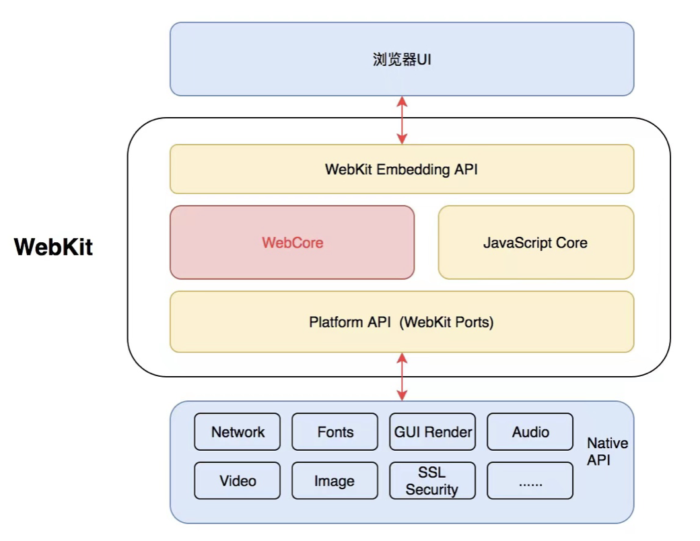

# 为什么iOS应用可以展示h5页面？

当我们的应用要内嵌h5页面时，我们很自然的想到要用WKWebview，但是WKWebview为什么能够显示由html、css、js组成的页面呢？

## WebKit.framework

WKWebview是一个Web容器，也是我们展示Web页面的关键。WKWebview是WebKit框架中的一个类，所以关于html、css、js的解析和渲染都是由WebKit这个framework来实现的。

有一些前端的小伙伴可能会问，WebKit不是一个开源的浏览器引擎吗？怎么变成iOS的framework了？这里解释下，WebKit.framework是基于WebKit中的WebCore、底层桥接、JSCore引擎等核心模块的基础上，针对iOS平台的封装。所以关于h5页面的解析和渲染等也都是靠WebKit这个开源浏览器引擎来做的。

## WebKit

所以我们先来看下什么WebKit是什么？WebKit是苹果开发的开源浏览器引擎，主要用于在Safari浏览器以及所有iOS浏览器中。其它的比较有名的比如黑莓浏览器、从 PS3 开始的PS游戏机内浏览器、 Kindle附带的浏览器也使用WebKit。

先看下WebKit的架构图，上层的`WebKit Embedding API`是负责浏览器UI与WebKit进行交互的部分。中间的`WebCore`和`JavaScript Core`是WebKit的核心，`WebCore`是渲染引擎，包含了HTML和CSS的解析、布局和定位、渲染HTML的功能逻辑；`JavaScript Core`是JS引擎，也被成为JS虚拟机，用于处理执行 JavaScript代码。最下层的`WebKit Ports`提供的一些调用Native Library的接口,让Webkit更加方便的移植到各个操作系统、平台上。

iOS中的JavaScriptCore.framework也是对WebKit中`JavaScript Core`的封装。

谷歌的浏览器引擎Blink内部的渲染引擎也是基于`WebCore`开发出来的，谷歌浏览3器的JS引擎用的不是`JavaScript Core`，而是V8。

了解了WebKit的组成，也就明白了h5是通过什么来进行解析渲染的了。像一些比较知名的动态化解决方案，React Native的原理也是通过JavaScriptCore.framework为核心来运作的。

## 参考

https://en.wikipedia.org/wiki/WebKit