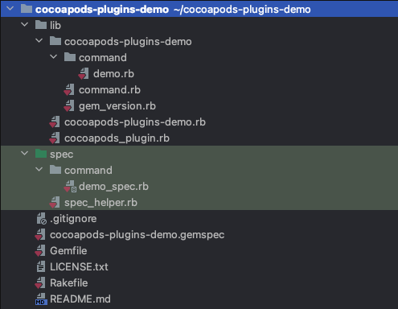
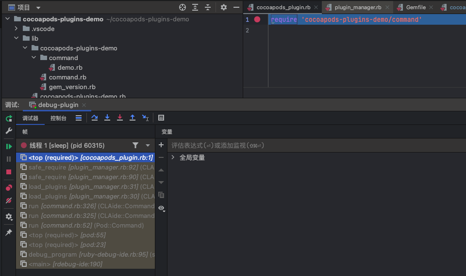

# 从0开发一个Cocoapods插件

从[Cocoapods插件文档](https://guides.cocoapods.org/plugins/setting-up-plugins.html)可知，Cocoapods的插件本质上是一个Ruby Gem。Cocoapods也提供了一个[cocoapods-plugins](https://github.com/CocoaPods/cocoapods-plugins)的Gem来方便开发者管理和创建Cocoapods插件。

## 创建一个Cocoapods插件项目

我们就用cocoapods-plugins来创建一个插件项目`cocoapods-plugins-demo`。

```bash
$ pod plugins create plugins-demo
```

cocoapods-plugins会识别创建的项目名，如果不是cocoapods开头会自动帮你加上cocoapods-的前缀。

我们可以使用VSCode、Ruby Mine或者是其他你喜欢的IDE来开发。

## 项目结构

笔者使用的Ruby Mine，打开项目，先看下目录结构。



其中，lib文件夹就是我们存放代码的文件夹，spec是存放单测的文件夹。cocoapods-plugins-demo.gemspec就是当前这个插件的描述文件，有点类似于描述Pod信息的podspec文件。Gemfile中放的是要开发时用到的Ruby Gem。

我们重点看下lib文件夹。cocoapods_plugin.rb是插件加载时引入的文件，插件加载时，会执行`require cocoapods_plugin.rb`。cocoapods-plugins-demo.rb可以理解为是插件的入口文件。

## 单元测试

关于Ruby单测，Ruby标准库内置了test-unit，用法与Xcode中的XCTest相似，通过断言(assert)来实现测试功能。Cocoapods内部的单测是使用的Bacon这个Gem，Bacon是更轻量级的RSpec组件，RSpec是基于BDD(行为驱动开发) 的，RSpec的入门可以看下这个[RSpec入门](https://semaphoreci.com/community/tutorials/getting-started-with-rspec)。

## 调试

我们有了这么一个插件项目之后，我们怎么调试呢？

比较简单的方案是，借助Bundler和Podfile文件来进行调试。

我们先来回想下，使用Bundler来管理Gem依赖的时候，我们怎么使用一个Cocoapods插件。首先在Gemfile中把`gem 'xxx'`加入进去，然后执行bundle install来安装插件。然后在Podfile文件中写入`plugin 'xxx'`。这样我们就可以使用插件了。所以我们可以在Gemfile中将gem依赖指向本地路径来进行调试。

我们随便创建一个iOS项目，然后执行`bundle init`和`pod init`来创建Gemfile和Podfile，然后在Gemfile中加入Cocoapods的依赖和我们插件项目的依赖，并将插件地址指向我们创建的插件项目的gemspec文件所在的文件夹。还需要加入调试器的依赖。


这一步其实有点类似于本地调试Pod。然后我们执行`bundle install`来安装插件。然后我们在Podfile中写入`plugin 'cocoapods-plugins-demo'`。

最后我们需要配置一下调试环境，笔者使用的是Ruby Mine，在Ruby Mine中调试配置中新添加一个Ruby类型的配置。


VSCode中也有类似的配置（需要创建一个.vscode/launch.json文件）


上面两个配置我们的脚本目录都填写pod命令的地址，我们可以从`pod env`命令中拿到这个地址。


配置完之后我们就可以调试了，我们可以在cocoapods-plugin.rb文件里打个断点。然后运行IDE的调试功能，我们就会发现程序会停在断点的位置，还可以看到相关的堆栈信息。



## Demo

我们一般开发Cocoapods的插件都是想通过hook `pod install`的流程来做一些事情，我们就来写一个简单的demo，在`pod install`之后将所有的Pod依赖输出到命令行中。

我们先在iOS项目中，通过Cocoapods，将SnapKit、RxSwift库集成进项目中。


因为不管pod执行什么命令，都会先去加载cocoapods-plugin.rb文件，所以我们在cocoapods-plugin.rb中注入对post-install的hook函数。


我们怎么获取到所有的Pod依赖项呢？我们可以看到这个Hook的回调中会传递给我们一个`context`对象，我们可以通过调试这个对象，看看里面有没有我们需要的内容。


Sandbox就是用来描述Pods文件夹的一个类，所以我们可以从Sandbox类中的manifest属性获取到我们需要的内容。最后我们通过Cocoapods提供的控制台输出方法将信息打印出来。

