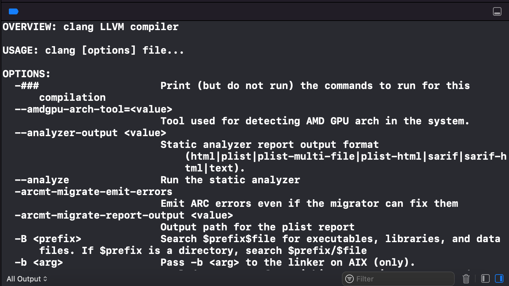

# 用Xcode调试Clang源码

我们在iOS开发中，可能对代码编译的环节比较感兴趣，iOS的编译器Clang是一个开源项目，所以我们可以很轻松的看到[Clang的源码](https://github.com/llvm/llvm-project)，Clang也有官方的[API文档](https://clang.llvm.org/doxygen/index.html)供我们检索API。但是Clang的代码非常繁多，比如我们想要之后Clang是如何查找头文件的，我们很难去从众多的API中找到他们，可能找到了源码，以很难将他们串联起来。所以我们期望能够借助IDE，在Clang编译过程进行Clang源码的断点调试。

本文介绍了怎么使用Xcode来进行Clang源码的调试。

## clone

我们要调试Clang源码，首先我们需要下载[源码](https://github.com/llvm/llvm-project)，由于Clang的源码非常大，下载过程比较长，因为我们只需要进行源码的调试也不需要进行代码的贡献，所以我们可以使用浅克隆。如果需要指定版本，可以加`-b`指定分支。

`git clone --depth=1 https://github.com/llvm/llvm-project.git`

> For normal users looking to just compile, this command works fine. But if someone later becomes a contributor, since they can't push code from a shallow clone, it needs to be converted into a full clone

## cmake

平时Xcode使用的是Xcode内置的Clang编译器，我们无法对这个内置的编译器进行代码调试，所以我们需要构建一个自己的Clang编译器的二进制可执行文件来进行编译。

源码里只包含了所有的代码，所以我们使用官方推荐的[cmake](https://llvm.org/docs/CMake.html)来进行生成我们的项目信息和构建环境，通过生成的项目来构建我们自己的Clang编译器。cmake可以通过homebrew安装，或者从[官方下载](https://cmake.org/)。cmake还提供了生成Xcode项目的参数，所以我们指定`-G Xcode`。

- `cd llvm-project`
- `mkdir build`
- `cd build`
- `cmake -DLLVM_ENABLE_PROJECTS=clang -G "Xcode" ../llvm`

## Xcode

cmake完成之后我们在build目录中就可以看到一个LLVM.xcodeproj的项目文件，我们使用Xcode打开。

从Xcode打开会提示是否要自动创建Schemes，这里选手动创建，因为这个项目包含的Scheme特别多，自动创建会很难找到我们需要的Scheme，然后我们手动创建Scheme的时候选择clang这个target。

然后我们怎么给clang传递参数呢？我们在Xcode中，选择Edit Scheme，选择clang这个scheme，然后再Run阶段的Arguments参加参数。

比如我们这里添加--help参数先简单测试下。然后我们点击运行，第一次运行的时间会非常久！因为要构建Clang自己及其所有的依赖，不过后面每次运行都会走增量构建，时间就很快了。

运行成功后我们会在控制台，看到输出的结果。

## 调试

那我们怎么调试源码呢，Xcode继承了lldb调试器，所以我们可以使用现成的lldb进行调试。比如我们想知道上面clang --help的运行堆栈，我们全局搜一下控制台第一行`OVERVIEW:`这个单词，然后再出现的代码位置中打上断点，重新运行一次。

我们发现断点停在了LLVMOption库中的OptTable.cpp这个文件中，左边有相关的运行堆栈，我们还可以使用lldb的命令进行调试。

## 总结

我们要调试Clang源码，首先需要下载clang的源码到本地，然后通过cmake工具来构建Xcode项目以及构建环境，然后使用Xcode来构建我们自己的clang编译器的可执行代码，同时在Scheme配置中添加clang执行需要的参数。最后通过Xcode自带的lldb调试器进行断点调试。

## 参考

https://clang.llvm.org/get_started.html

https://llvm.org/docs/CMake.html